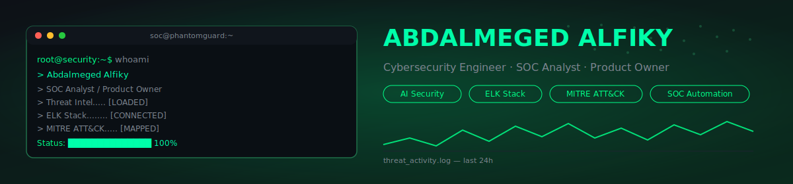
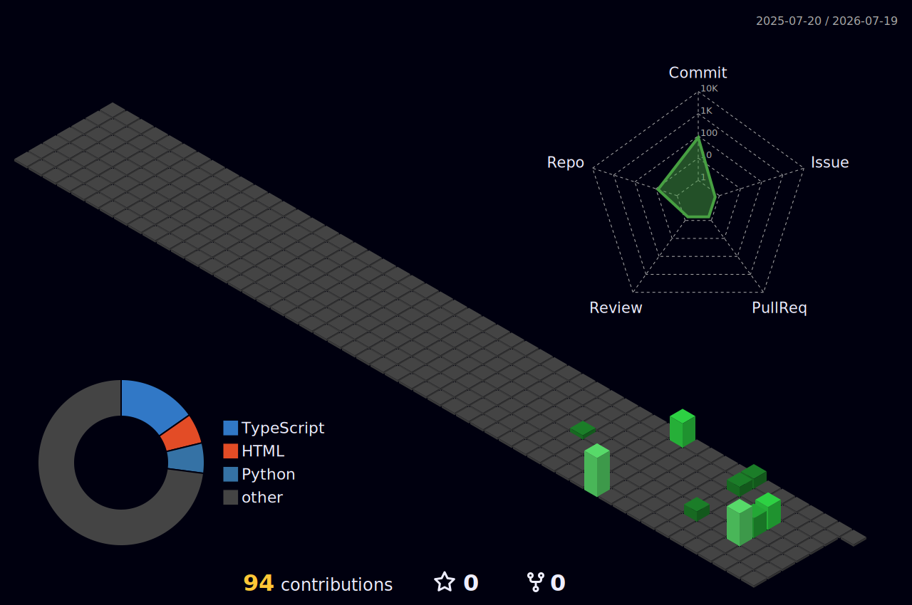

<div align="center">

<!-- ===================== BANNER (custom, no third-party render service) ===================== -->


<!-- ===================== TYPING ANIMATION ===================== -->
<a href="#">
  
</a>

<!-- ===================== BADGES ===================== -->
<p>
  
  
  
</p>

<p>
  <a href="https://www.linkedin.com/in/abdalmeged-alfiky"></a>
  <a href="https://abdalmegedalfiky-ops.github.io"></a>
  <a href="mailto:abdalmegedalfiky@gmail.com"></a>
</p>

</div>

---

### `root@security:~$ whoami`

```text
> Abdalmeged Alfiky
> Role:        SOC Analyst / Cybersecurity Engineer / Product Owner
> Based in:    Tanta, Gharbia, Egypt
> Education:   B.Sc. Computer Science — Tanta University
> Focus:       Detection Engineering · AI Security · SOAR · Threat Hunting
> Status:      [ONLINE] Building secure systems & shipping product
```

## 🧭 About Me

I'm a Product Owner at **Dash** (a Saudi last-mile delivery aggregator), with a background that bridges **cybersecurity, networking, and systems administration**. I started in network engineering and SOC/technical support, moved through Egyptian Army Signal Corps service, and now combine that hands-on security depth with product strategy.

On the side, I build practical security tooling — SIEM pipelines, AI-assisted SOAR platforms, and vulnerability-management labs — and document everything publicly as part of my learning process.

- 🛡️ SOC fundamentals: log analysis, detection engineering, incident response
- 🤖 Currently exploring how LLMs (Claude API) can augment SOC workflows (enrichment, triage, auto-response)
- 📦 Product Owner experience translating technical/security constraints into roadmaps
- 🌍 Native Arabic (Egyptian) speaker, technical English documentation

## 🎯 Current Focus

```yaml
detection_engineering: active
ai_security:           active
soar_automation:       active
threat_hunting:        ongoing
product_strategy:      active   # Dash Logistics Hub
```

## 🧰 Tech Stack

<p>
  
  
  
  
  
  
  
  
</p>

## 🛡️ Cybersecurity Skills

<p>
  
  
  
  
  
  
  
  
</p>

## 📊 GitHub Stats

<p align="center">
  
  
</p>

<p align="center">
  
</p>

<p align="center">
  
</p>

<!-- Contribution Snake — generated by .github/workflows/snake.yml -->
<p align="center">
  
</p>

<!-- 3D Contribution Image — generated daily by .github/workflows/skyline.yml -->
<p align="center">
  
</p>

<!-- Visitor Counter — live badge, no workflow needed (already in header badges above) -->

## 🚀 Featured Projects

| Project | Description | Stack |
|---|---|---|
| **PhantomGuard** | AI-powered SOAR platform integrating Claude API with ELK Stack — confidence-gated auto-response, MITRE ATT&CK enrichment | Flask, ELK, SQLite, Claude API |
| **SOC-SIEM-ELK-Windows-Monitoring** | ELK Stack SIEM deployment with detection rules mapped to MITRE ATT&CK (T1110, T1078, T1068, T1136, T1531) | Elasticsearch, Kibana, Filebeat |
| **SOC-Phishing-THM** | Bilingual phishing investigation lab with MITRE ATT&CK mapping (TryHackMe SOC Simulator) | SOC Playbooks |
| **PenTerra** | Multi-module Python cybersecurity platform (graduation project) — keylogging, traffic analysis, network/port scanning | Python, Tkinter |

## 🎓 Certifications

<p>
  
  
  
  
  
</p>

## 🗺️ Learning Roadmap

- [ ] Detection Engineering (Sigma / YARA rule authoring)
- [ ] Purple Team methodology
- [ ] Malware Analysis fundamentals
- [ ] Cloud Security (AWS/Azure)
- [ ] Kubernetes Security
- [ ] Threat Intelligence platforms
- [ ] AI Security / LLM red-teaming

## 📡 Connect With Me

<p>
  <a href="https://www.linkedin.com/in/abdalmeged-alfiky"></a>
  <a href="https://abdalmegedalfiky-ops.github.io"></a>
  <a href="mailto:abdalmegedalfiky@gmail.com"></a>
</p>

<div align="center">

> *"Detection is better than reaction. Logs never lie."*


</div>
